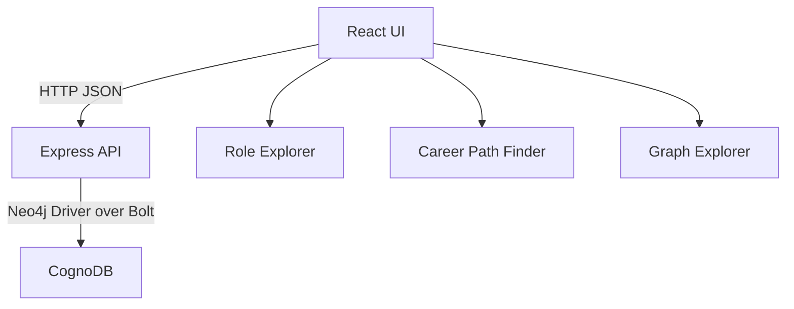
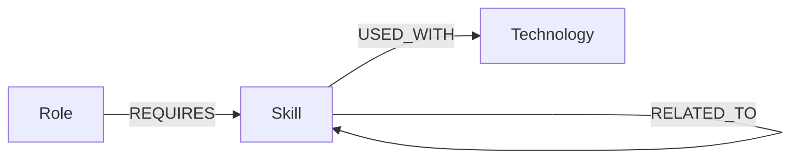
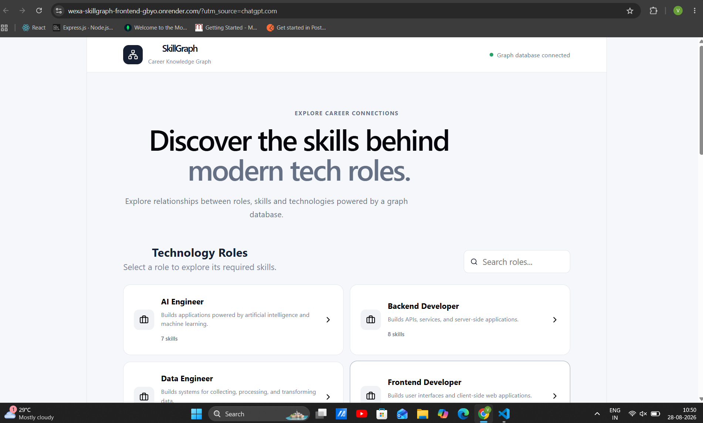
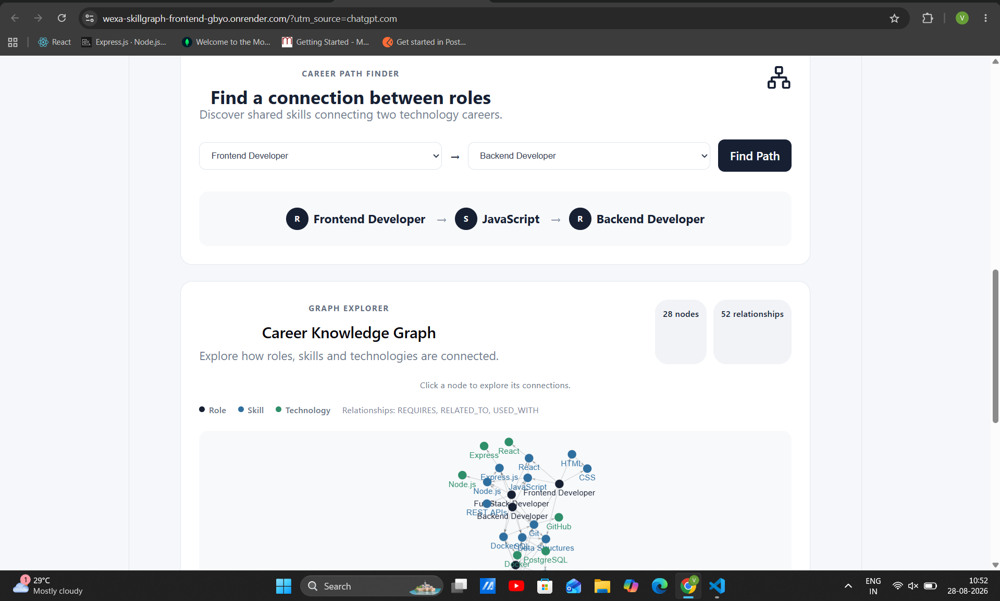
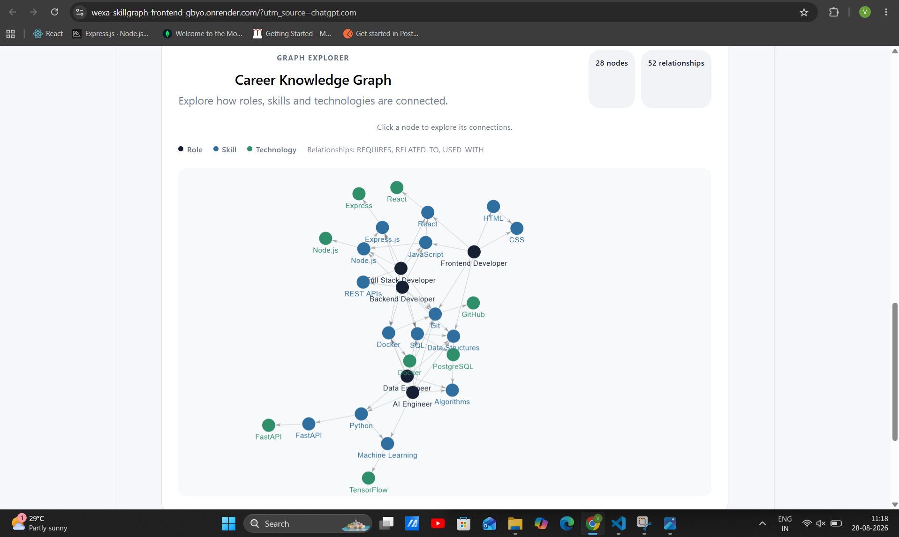

# SkillGraph
## Career Knowledge Graph

SkillGraph is an interactive career exploration application backed by CognoDB. It helps users understand how technology roles, skills, and technologies connect.

## Overview

Users can:

- Explore technology roles and their required skills.
- Select a skill to discover related skills and technologies.
- Find a shared skill connecting two career roles.
- Explore the complete graph visually.
- See the live CognoDB connection status.

## Why a Graph Database?

Career knowledge is defined by connections. A role requires skills, skills relate to other skills, and skills are used with technologies. CognoDB represents these connections directly, making multi-hop discovery natural to express with Cypher.

For example, the application can traverse from a skill to a related skill and then to a technology in one query. The career-path query also finds a shared skill between two roles by traversing both roles' `REQUIRES` relationships.

## Technology Stack

| Layer | Technologies |
| --- | --- |
| Frontend | React, Vite, Axios, react-force-graph-2d, CSS |
| Backend | Node.js, Express, CORS, dotenv |
| Database | CognoDB, Neo4j JavaScript Driver, openCypher, Bolt |

## Architecture



## Graph Data Model

### Nodes

- `Role`: A technology career, such as Frontend Developer or AI Engineer. Role nodes have `name` and `description` properties.
- `Skill`: A skill required by one or more roles, such as JavaScript, Python, or SQL.
- `Technology`: A concrete technology associated with a skill, such as React, PostgreSQL, or TensorFlow.

### Relationships



## Main Cypher Queries

### Get all roles and their skills

```cypher
MATCH (role:Role)-[:REQUIRES]->(skill:Skill)
RETURN role.name AS role, collect(skill.name) AS skills
ORDER BY role
```

### Explore a role's skills

```cypher
MATCH (role:Role {name: $roleName})-[:REQUIRES]->(skill:Skill)
RETURN role.name AS role,
       role.description AS description,
       collect(skill.name) AS skills
```

The role name is supplied as the `$roleName` parameter.

### Multi-hop skill exploration

```cypher
MATCH path = (skill:Skill)-[:RELATED_TO|USED_WITH*1..2]->(connected)
WHERE skill.name = $skillName
RETURN path
LIMIT 20
```

This 1-to-2-hop traversal discovers connected skills and technologies. Traversing variable-depth relationships is a natural graph operation and avoids manually assembling multiple relationship joins.

### Career connection

```cypher
MATCH (start:Role {name: $from})
MATCH (target:Role {name: $to})
MATCH (start)-[:REQUIRES]->(shared:Skill)<-[:REQUIRES]-(target)
RETURN start.name AS fromRole,
       shared.name AS sharedSkill,
       target.name AS toRole
LIMIT 1
```

This query finds a shared skill connecting two roles using the `$from` and `$to` parameters.

## Seed Data

The seed script is [`backend/scripts/seed.js`](backend/scripts/seed.js). It creates:

- 5 `Role` nodes.
- 15 `Skill` nodes.
- 8 `Technology` nodes.
- `REQUIRES`, `RELATED_TO`, and `USED_WITH` relationships.

The script clears the existing graph before loading the dataset, so it can be rerun during development.

Run it from the backend directory:

```bash
cd backend
node scripts/seed.js
```

## Project Structure

```text
wexa-skillgraph/
├── backend/
│   ├── src/
│   │   ├── config/database.js
│   │   ├── routes/routes.js
│   │   └── server.js
│   ├── scripts/seed.js
│   ├── .gitignore
│   └── package.json
├── frontend/
│   ├── src/
│   │   ├── App.jsx
│   │   ├── App.css
│   │   ├── GraphView.jsx
│   │   └── main.jsx
│   ├── .gitignore
│   ├── index.html
│   └── package.json
└── README.md
```

## Environment Variables

Never commit `.env` files. The backend ignores `.env`, and the frontend ignores local environment files through its `.gitignore` rules.

### Backend

Create `backend/.env`:

```text
COGNODB_URI=bolt+s://your-instance.databases.cognodb.com
COGNODB_USERNAME=cognodb
COGNODB_PASSWORD=your-password
PORT=5000
FRONTEND_URL=http://localhost:5173
```

`PORT` defaults to `5000`. `FRONTEND_URL` configures the allowed frontend origin; when it is not set, localhost development origins are allowed.

### Frontend

Create `frontend/.env`:

```text
VITE_API_URL=http://localhost:5000
```

The frontend uses this value for the backend API and health-check requests. Define it before starting Vite or building the frontend.

## CognoDB Setup

1. Create a CognoDB account and instance.
2. Copy the instance Bolt URI and generated database password.
3. Add the required values to `backend/.env`.
4. Install backend dependencies.
5. Run the seed script.
6. Start the backend.

The application uses the Neo4j JavaScript driver to communicate with CognoDB over Bolt.

## Installation and Local Run

### Backend

```bash
cd backend
npm install
node scripts/seed.js
npm start
```

The backend listens on `http://localhost:5000` by default.

### Frontend

In a second terminal:

```bash
cd frontend
npm install
npm run dev
```

The frontend runs on `http://localhost:5173` by default.

## API Endpoints

| Method | Endpoint | Description |
| --- | --- | --- |
| GET | `/health` | Verifies backend and CognoDB connectivity. |
| GET | `/api/roles` | Returns all roles with their required skills. |
| GET | `/api/roles/:roleName` | Returns one role and its required skills. |
| GET | `/api/skills` | Returns skills and associated technologies. |
| GET | `/api/graph` | Returns graph nodes and relationships. |
| GET | `/api/graph/explore/:skillName` | Returns 1-to-2-hop skill connections. |
| GET | `/api/career-path?from=...&to=...` | Finds a shared skill between two roles. |

## Error Handling

The backend returns sanitized error responses for database failures and uses HTTP 503 when CognoDB is unavailable. Missing resources return HTTP 404, and missing career-path parameters return HTTP 400. The frontend displays loading, empty, connection, and graph error states.

## Deployment

The backend can be deployed as a Node.js/Express service. Configure these backend environment variables in the hosting provider:

- `COGNODB_URI`
- `COGNODB_USERNAME`
- `COGNODB_PASSWORD`
- `PORT`
- `FRONTEND_URL`

Configure the frontend build environment variable:

- `VITE_API_URL`

Never commit `.env` files. Start the backend with:

```bash
npm start
```

Build the frontend with:

```bash
npm run build
```

Set `FRONTEND_URL` to the deployed frontend origin and `VITE_API_URL` to the deployed backend origin. Do not include `/api` in `VITE_API_URL`; the frontend appends that path for API calls.

## Screenshots

### Role Explorer



### Career Path Finder



### Graph Explorer



### Visual Demo


## Hosted Demo

Live Demo:
https://wexa-skillgraph-frontend-gbyo.onrender.com

Backend API:
https://wexa-skillgraph-backend-p96r.onrender.com

## Screen Recording

The repository includes the SkillGraph demo GIF at:

./screenshots/skillgraph-demo.gif

## Assignment Context

This project was developed as a take-home assessment for the Software Engineer (Full-Stack / Web Developer) role at Wexa AI. It demonstrates graph data modeling, Cypher queries, backend API design, and an interactive frontend experience using CognoDB.